# Arquitectura del Sistema AWS Propuestas v3

## 🏗️ Visión General

AWS Propuestas v3 es un sistema serverless que utiliza inteligencia artificial para generar automáticamente propuestas técnicas y comerciales para proyectos AWS. La arquitectura está diseñada para ser escalable, resiliente y completamente dinámica.

## 📐 Diagrama de Arquitectura


## 🔧 Componentes Principales

### 1. Frontend Layer

#### Next.js Application
- **Framework**: Next.js 14 con App Router
- **Hosting**: AWS Amplify
- **Características**:
  - Server-Side Rendering (SSR)
  - Static Site Generation (SSG)
  - Optimización automática
  - CDN global

#### Componentes React
```typescript
components/
├── ui/                 # Componentes base (Button, Input, etc.)
├── chat/              # Componentes de chat
│   ├── ChatInterface.tsx
│   ├── MessageBubble.tsx
│   └── TypingIndicator.tsx
├── projects/          # Gestión de proyectos
│   ├── ProjectList.tsx
│   ├── ProjectCard.tsx
│   └── ProjectDetails.tsx
└── layout/            # Layout components
    ├── Header.tsx
    ├── Sidebar.tsx
    └── Footer.tsx
```

### 2. API Layer

#### API Gateway Configuration
```yaml
ApiGateway:
  Type: AWS::ApiGateway::RestApi
  Properties:
    Name: aws-propuestas-v3-api
    EndpointConfiguration:
      Types: [REGIONAL]
    Cors:
      AllowOrigin: "*"
      AllowMethods: [GET, POST, PUT, DELETE, OPTIONS]
      AllowHeaders: [Content-Type, Authorization]
```

#### Endpoints
- `POST /arquitecto` - Chat del arquitecto
- `POST /chat` - Chat general
- `GET /projects` - Listar proyectos
- `POST /projects` - Crear proyecto
- `GET /documents/{id}` - Obtener documentos
- `GET /health` - Health check

### 3. Compute Layer

#### Lambda Functions

##### Arquitecto Function
```python
# lambda/arquitecto/app.py
def lambda_handler(event, context):
    # 1. Analizar conversación
    # 2. Extraer información del proyecto
    # 3. Detectar servicios AWS dinámicamente
    # 4. Generar documentos específicos
    # 5. Subir a S3
    # 6. Guardar en DynamoDB
```

**Características**:
- Runtime: Python 3.9
- Memory: 2048 MB
- Timeout: 5 minutos
- Concurrency: 100

##### Generadores Dinámicos
```python
# generators/dynamic_generator.py
def extract_services_from_analysis(ai_analysis: str) -> List[str]:
    """Extrae servicios AWS mencionados en el análisis de IA"""
    service_keywords = {
        'api gateway': 'Amazon API Gateway',
        'lambda': 'AWS Lambda',
        's3': 'Amazon S3',
        # ... 50+ servicios más
    }
    
def generate_dynamic_cloudformation(project_info, ai_analysis) -> str:
    """Genera CloudFormation específico para servicios detectados"""
    services = extract_services_from_analysis(ai_analysis)
    # Genera recursos específicos para cada servicio
```

### 4. AI/ML Layer

#### Amazon Bedrock Integration
```python
# Configuración de Bedrock
bedrock_client = boto3.client('bedrock-runtime', region_name='us-east-1')

# Modelos soportados (FUNCIONANDO EN PRODUCCIÓN)
SUPPORTED_MODELS = {
    'nova-pro': 'amazon.nova-pro-v1:0',           # ✅ invoke_model API
    'claude-sonnet': 'anthropic.claude-3-5-sonnet-20240620-v1:0'  # ✅ converse API
}

# Formato de mensajes para Bedrock
def format_messages_for_bedrock(messages):
    """Convierte mensajes del frontend al formato requerido por Bedrock"""
    bedrock_messages = []
    for i, msg in enumerate(messages):
        content = msg.get('content', '')
        # Convertir string a array format
        if isinstance(content, str):
            bedrock_content = [{"text": content}]
        else:
            bedrock_content = content
        
        # Primer mensaje debe ser siempre 'user'
        role = msg.get('role', 'user')
        if i == 0 and role != 'user':
            role = 'user'
        
        bedrock_messages.append({
            "role": role,
            "content": bedrock_content
        })
    
    return bedrock_messages
```

#### Análisis Dinámico
```python
def analyze_conversation(messages: List[Dict]) -> Dict:
    """
    Analiza la conversación para extraer:
    - Nombre del proyecto
    - Tipo de solución
    - Servicios AWS requeridos
    - Requerimientos técnicos
    - Presupuesto y timeline
    """
```

### 5. Storage Layer

#### DynamoDB Tables

##### Projects Table
```yaml
ProjectsTable:
  Type: AWS::DynamoDB::Table
  Properties:
    TableName: aws-propuestas-v3-projects-prod
    BillingMode: PAY_PER_REQUEST
    AttributeDefinitions:
      - AttributeName: projectId
        AttributeType: S
      - AttributeName: userId
        AttributeType: S
    KeySchema:
      - AttributeName: projectId
        KeyType: HASH
    GlobalSecondaryIndexes:
      - IndexName: UserIndex
        KeySchema:
          - AttributeName: userId
            KeyType: HASH
        Projection:
          ProjectionType: ALL
```

**Estructura de Datos**:
```json
{
  "projectId": "uuid",
  "userId": "anonymous",
  "projectInfo": {
    "name": "string",
    "type": "servicio_rapido|solucion_integral",
    "services": ["Amazon API Gateway", "AWS Lambda"],
    "aws_services": ["Amazon API Gateway", "AWS Lambda"],
    "requirements": ["string"],
    "objective": "string"
  },
  "messages": [
    {
      "role": "user|assistant",
      "content": "string",
      "timestamp": "ISO8601"
    }
  ],
  "status": "IN_PROGRESS|COMPLETED",
  "createdAt": "timestamp",
  "updatedAt": "timestamp",
  "completedAt": "timestamp"
}
```

##### Chat Sessions Table
```yaml
ChatSessionsTable:
  Type: AWS::DynamoDB::Table
  Properties:
    TableName: aws-propuestas-v3-chat-sessions-prod
    BillingMode: PAY_PER_REQUEST
    AttributeDefinitions:
      - AttributeName: sessionId
        AttributeType: S
    KeySchema:
      - AttributeName: sessionId
        KeyType: HASH
    TimeToLiveSpecification:
      AttributeName: ttl
      Enabled: true
```

#### S3 Bucket Structure
```
aws-propuestas-v3-documents-prod-{account-id}/
├── {project-name}/
│   ├── {project-name}-propuesta-ejecutiva.docx
│   ├── {project-name}-documento-tecnico.docx
│   ├── {project-name}-cloudformation-template.yaml
│   ├── {project-name}-actividades-implementacion.csv
│   ├── {project-name}-costos-estimados.csv
│   ├── {project-name}-arquitectura-general.svg
│   ├── {project-name}-arquitectura-general.drawio
│   └── {project-name}-guia-calculadora-aws.txt
└── projects/
    └── anonymous/
        └── {project-id}/
            └── [legacy structure]
```

### 6. Security Layer

#### IAM Roles y Políticas

##### Lambda Execution Role
```yaml
LambdaExecutionRole:
  Type: AWS::IAM::Role
  Properties:
    AssumeRolePolicyDocument:
      Version: '2012-10-17'
      Statement:
        - Effect: Allow
          Principal:
            Service: lambda.amazonaws.com
          Action: sts:AssumeRole
    ManagedPolicyArns:
      - arn:aws:iam::aws:policy/service-role/AWSLambdaBasicExecutionRole
    Policies:
      - PolicyName: DynamoDBAccess
        PolicyDocument:
          Version: '2012-10-17'
          Statement:
            - Effect: Allow
              Action:
                - dynamodb:GetItem
                - dynamodb:PutItem
                - dynamodb:UpdateItem
                - dynamodb:Query
                - dynamodb:Scan
              Resource: 
                - !GetAtt ProjectsTable.Arn
                - !GetAtt ChatSessionsTable.Arn
      - PolicyName: S3Access
        PolicyDocument:
          Version: '2012-10-17'
          Statement:
            - Effect: Allow
              Action:
                - s3:GetObject
                - s3:PutObject
                - s3:DeleteObject
              Resource: !Sub "${DocumentsBucket}/*"
      - PolicyName: BedrockAccess
        PolicyDocument:
          Version: '2012-10-17'
          Statement:
            - Effect: Allow
              Action:
                - bedrock:InvokeModel
              Resource: "*"
```

#### Cifrado

##### En Reposo
- **DynamoDB**: Cifrado con AWS KMS
- **S3**: Cifrado AES-256
- **CloudWatch Logs**: Cifrado con KMS

##### En Tránsito
- **API Gateway**: HTTPS/TLS 1.2+
- **Lambda**: Comunicación interna cifrada
- **Bedrock**: HTTPS/TLS 1.2+

## 🔄 Flujo de Datos

### 1. Flujo Principal de Conversación

```mermaid
sequenceDiagram
    participant U as Usuario
    participant F as Frontend
    participant A as API Gateway
    participant L as Arquitecto Lambda
    participant B as Bedrock
    participant D as DynamoDB
    participant S as S3

    U->>F: Inicia conversación
    F->>A: POST /arquitecto
    A->>L: Invoke function
    L->>B: Analizar conversación
    B-->>L: Respuesta + análisis
    L->>L: Extraer servicios AWS
    L->>L: Generar documentos
    L->>S: Subir documentos
    L->>D: Guardar proyecto
    L-->>A: Respuesta con documentos
    A-->>F: JSON response
    F-->>U: Mostrar respuesta
```



### 2. Flujo de Generación de Documentos


## 🚀 Escalabilidad

### Horizontal Scaling
- **Lambda**: Auto-scaling hasta 1000 ejecuciones concurrentes
- **API Gateway**: Maneja millones de requests por segundo
- **DynamoDB**: Auto-scaling de read/write capacity
- **S3**: Escalabilidad ilimitada

### Performance Optimizations
- **Lambda Cold Start**: Provisioned concurrency para funciones críticas
- **DynamoDB**: Índices secundarios globales para queries eficientes
- **S3**: CloudFront para distribución global de documentos
- **API Gateway**: Caching de respuestas

### Monitoring y Alertas
```yaml
CloudWatchAlarms:
  - LambdaErrors
  - LambdaDuration
  - APIGateway4XXErrors
  - APIGateway5XXErrors
  - DynamoDBThrottles
  - S3Errors
```

## 🔧 Configuración de Desarrollo

### Local Development
```bash
# Backend
sam local start-api --template infrastructure/template.yaml

# Frontend
npm run dev
```

### Testing
```bash
# Unit Tests
pytest lambda/tests/

# Integration Tests
npm run test:integration

# E2E Tests
npm run test:e2e
```

### CI/CD Pipeline
```yaml
# .github/workflows/deploy.yml
name: Deploy to AWS
on:
  push:
    branches: [main]
jobs:
  deploy:
    runs-on: ubuntu-latest
    steps:
      - uses: actions/checkout@v3
      - name: Setup Node.js
        uses: actions/setup-node@v3
      - name: Setup Python
        uses: actions/setup-python@v4
      - name: Deploy Backend
        run: sam deploy
      - name: Deploy Frontend
        run: amplify publish
```

## 📊 Métricas y Monitoreo

### Key Performance Indicators (KPIs)
- **Response Time**: < 3 segundos para generación de documentos
- **Availability**: 99.9% uptime
- **Error Rate**: < 0.1%
- **Document Generation Success Rate**: > 99%

### CloudWatch Dashboards
- Lambda performance metrics
- API Gateway request metrics
- DynamoDB performance metrics
- S3 storage metrics
- Bedrock usage metrics

### Alerting Strategy
- Critical: P1 alerts for service outages
- Warning: P2 alerts for performance degradation
- Info: P3 alerts for usage thresholds

## 🔒 Consideraciones de Seguridad

### Threat Model
- **Data in Transit**: HTTPS/TLS encryption
- **Data at Rest**: KMS encryption
- **Authentication**: IAM roles and policies
- **Authorization**: Least privilege access
- **Input Validation**: Request validation at API Gateway
- **Output Sanitization**: Content filtering in responses

### Compliance
- **GDPR**: Data retention policies
- **SOC 2**: Security controls
- **AWS Well-Architected**: Security pillar compliance

## 🔄 Disaster Recovery

### Backup Strategy
- **DynamoDB**: Point-in-time recovery enabled
- **S3**: Cross-region replication
- **Lambda**: Code stored in version control
- **Infrastructure**: Infrastructure as Code

### Recovery Procedures
- **RTO**: 4 hours
- **RPO**: 1 hour
- **Multi-region**: Standby region ready for failover

---

Esta arquitectura está diseñada para ser robusta, escalable y mantenible, siguiendo las mejores prácticas de AWS Well-Architected Framework.
