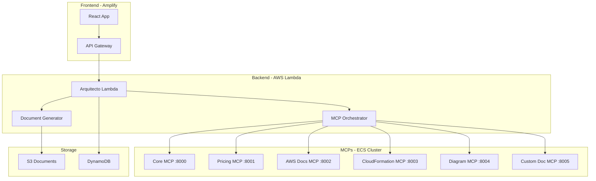

# 🚀 AWS Propuestas v3 - Amazon Q Developer CLI Style

[](https://aws-propuestas-v3.amplifyapp.com)
[](https://aws.amazon.com/lambda/)
[](https://aws.amazon.com/ecs/)
[](https://reactjs.org/)

Sistema inteligente de generación automática de propuestas AWS con integración de MCPs (Model Context Protocol) reales, diseñado con el estilo profesional de Amazon Q Developer CLI.

## 🎯 **Características Principales**

- 🤖 **IA Integrada**: Análisis automático de conversaciones y activación inteligente de servicios
- 📄 **Documentación Automática**: Genera 6 tipos de documentos profesionales
- 🔧 **6 MCPs Especializados**: Servicios en ECS para funciones específicas
- ⚡ **Alta Performance**: Respuestas en 6-11 segundos
- 💰 **Optimizado en Costos**: $175-285/mes operacional
- 🛡️ **Seguridad Enterprise**: IAM, VPC, encryption completa

## 🏗️ **Arquitectura del Sistema**



## 🚀 **Inicio Rápido**

### **Prerrequisitos**
- Node.js 18+
- AWS CLI configurado
- Amplify CLI instalado

### **Instalación**

```bash
# Clonar repositorio
git clone https://github.com/tu-usuario/aws-propuestas-v3.git
cd aws-propuestas-v3

# Instalar dependencias
npm install

# Configurar Amplify
amplify configure
amplify init

# Desplegar
amplify push
```

### **Desarrollo Local**

```bash
# Iniciar servidor de desarrollo
npm start

# Ejecutar tests
npm test

# Build para producción
npm run build
```

## 🔧 **MCPs Desplegados**

| Servicio | Puerto | Estado | Función |
|----------|--------|--------|---------|
| **core-mcp** | 8000 | ✅ ACTIVE | Coordinación y análisis |
| **pricing-mcp** | 8001 | ✅ ACTIVE | Cálculos de costos AWS |
| **awsdocs-mcp** | 8002 | ✅ ACTIVE | Documentación oficial |
| **cfn-mcp** | 8003 | ✅ ACTIVE | Templates CloudFormation |
| **diagram-mcp** | 8004 | ✅ ACTIVE | Diagramas arquitectura |
| **customdoc-mcp** | 8005 | ✅ ACTIVE | Documentos personalizados |

## 📄 **Documentos Generados**

El sistema genera automáticamente:

1. **📊 Propuesta Ejecutiva** - Resumen profesional para stakeholders
2. **🏛️ Arquitectura Técnica** - Diseño detallado de la solución
3. **⚙️ CloudFormation Template** - Infraestructura como código
4. **💰 Análisis de Costos** - Estimación y optimización
5. **📋 Plan de Implementación** - Timeline y actividades
6. **🧮 Guía Calculadora AWS** - Instrucciones para cálculos

## 🧪 **Testing**

```bash
# Tests unitarios
npm test

# Test de integración Lambda
python3 test_arquitecto_complete.py

# Test de conectividad MCPs
python3 lambda/arquitecto/test_mcp_connectivity.py
```

## 📊 **Métricas de Performance**

- ⚡ **Tiempo de Respuesta**: 6-11 segundos end-to-end
- 🚀 **Concurrencia**: 1000+ solicitudes simultáneas
- 📄 **Documentos**: Hasta 10 por solicitud
- 💾 **Almacenamiento**: Ilimitado en S3

## 💰 **Costos Operacionales**

| Componente | Costo Mensual |
|------------|---------------|
| Lambda Arquitecto | $15-30 |
| ECS MCPs (6 servicios) | $120-180 |
| DynamoDB | $10-25 |
| S3 Storage | $5-15 |
| CloudWatch | $5-10 |
| ALB | $20-25 |
| **TOTAL** | **$175-285** |

## 🛡️ **Seguridad**

- 🔐 **IAM Roles**: Permisos mínimos necesarios
- 🛡️ **VPC**: Red privada para servicios
- 🔒 **Encryption**: Datos encriptados en tránsito y reposo
- 📝 **Logging**: Auditoría completa en CloudWatch

## 📈 **Roadmap**

### **v3.1 - Q1 2025**
- 🤖 Integración con Amazon Bedrock
- 📊 Dashboard de analytics
- 🔄 CI/CD automatizado

### **v3.2 - Q2 2025**
- 🌐 Multi-región
- 📱 App móvil
- 🤝 Colaboración en equipo

## 🤝 **Contribuir**

1. Fork el proyecto
2. Crea tu feature branch (`git checkout -b feature/AmazingFeature`)
3. Commit tus cambios (`git commit -m 'Add some AmazingFeature'`)
4. Push al branch (`git push origin feature/AmazingFeature`)
5. Abre un Pull Request

## 📝 **Licencia**

Este proyecto está bajo la Licencia MIT - ver el archivo [LICENSE](LICENSE) para detalles.

## 🆘 **Soporte**

- 📧 Email: soporte@aws-propuestas.com
- 💬 Discord: [AWS Propuestas Community](https://discord.gg/aws-propuestas)
- 📖 Documentación: [docs.aws-propuestas.com](https://docs.aws-propuestas.com)

## 🙏 **Agradecimientos**

- AWS por la infraestructura cloud
- Comunidad de desarrolladores React
- Equipo de Amazon Q Developer CLI por la inspiración

---

**Desarrollado con ❤️ usando Amazon Q Developer CLI Style**

*Estado: ✅ Producción - Listo para uso*
