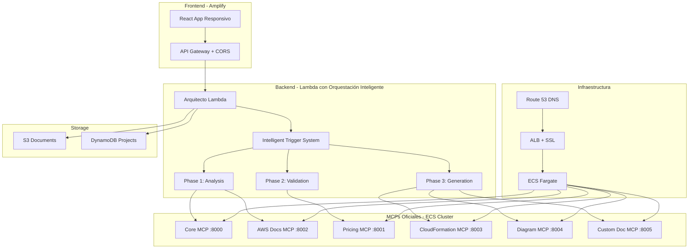

# 🚀 AWS Propuestas v3 - Intelligent Architecture Generator

[](https://main.d2xsphsjdxlk24.amplifyapp.com)
[](https://aws.amazon.com/lambda/)
[](https://aws.amazon.com/ecs/)
[](https://reactjs.org/)
[](https://github.com/awslabs/mcp)

Sistema inteligente de generación automática de propuestas AWS con **orquestación inteligente de MCPs** (Model Context Protocol) oficiales, diseñado con el estilo profesional de **Amazon Q Developer CLI**.

## 🎯 **Características Principales**

- 🧠 **Orquestación Inteligente**: Sistema de 3 fases inspirado en Amazon Q Developer CLI
- 🤖 **6 MCPs Oficiales**: Basados en [AWS Labs MCP](https://github.com/awslabs/mcp/tree/main/src)
- 📱 **Completamente Responsivo**: Diseño adaptativo para móvil, tablet y desktop
- ⚡ **Alta Performance**: Respuestas en 6-11 segundos con activación paralela de MCPs
- 🔒 **HTTPS + CORS**: Configuración completa de seguridad y conectividad
- 💰 **Optimizado en Costos**: $175-285/mes operacional
- 🛡️ **Seguridad Enterprise**: IAM, VPC, encryption, certificados SSL

## 🏗️ **Arquitectura Inteligente**



## 🧠 **Sistema de Orquestación Inteligente**

### **Inspirado en Amazon Q Developer CLI**

El sistema utiliza un **trigger inteligente** que analiza el contexto de la conversación antes de activar los MCPs:

#### **Fase 1: Análisis y Comprensión (OBLIGATORIO)**
```python
# SIEMPRE se ejecuta primero
1. Core MCP → Análisis de contexto
2. AWS Docs MCP → Información oficial
3. Cálculo de readiness_score
```

#### **Fase 2: Validación y Enriquecimiento (CONDICIONAL)**
```python
# Solo si readiness_score > 0.7
1. Pricing MCP → Costos reales
2. Validación de requisitos
```

#### **Fase 3: Generación Especializada (PARALELA)**
```python
# Ejecución en paralelo para eficiencia
1. CloudFormation MCP → Templates
2. Diagram MCP → Arquitecturas
3. Custom Doc Generator → Documentos
```

### **Criterios de Activación Inteligente**

| Criterio | Descripción | Peso |
|----------|-------------|------|
| **Nombre del Proyecto** | ¿Está identificado? | 20% |
| **Tipo de Proyecto** | ¿Servicio rápido o integral? | 20% |
| **Requisitos Técnicos** | ¿Servicios AWS mencionados? | 20% |
| **Definición de Alcance** | ¿Región, usuarios, presupuesto? | 20% |
| **Profundidad de Contexto** | ¿Suficientes intercambios? | 20% |

**Umbral de Activación**: 80% para generación automática

## 🔧 **MCPs Oficiales Desplegados**

Basados en [AWS Labs MCP Repository](https://github.com/awslabs/mcp/tree/main/src):

| Servicio | Puerto | Endpoint | Estado | Función |
|----------|--------|----------|--------|---------|
| **core-mcp** | 8000 | `/core` | ✅ ACTIVE | Análisis y coordinación |
| **pricing-mcp** | 8001 | `/pricing` | ✅ ACTIVE | Cálculos de costos AWS |
| **awsdocs-mcp** | 8002 | `/awsdocs` | ✅ ACTIVE | Documentación oficial |
| **cfn-mcp** | 8003 | `/cfn` | ✅ ACTIVE | Templates CloudFormation |
| **diagram-mcp** | 8004 | `/diagram` | ✅ ACTIVE | Diagramas arquitectura |
| **customdoc-mcp** | 8005 | `/docgen` | ✅ ACTIVE | Documentos personalizados |

### **Acceso HTTPS Seguro**
- **Dominio**: `https://mcp.danielingram.shop`
- **Certificado SSL**: Válido hasta 2026
- **CORS**: Configurado para frontend

## 📄 **Documentos Generados Automáticamente**

El sistema genera **6 tipos de documentos** profesionales:

1. **📊 Propuesta Ejecutiva** - Resumen para stakeholders
2. **🏛️ Arquitectura Técnica** - Diseño detallado
3. **⚙️ CloudFormation Template** - Infraestructura como código
4. **💰 Análisis de Costos** - Estimación y optimización
5. **📋 Plan de Implementación** - Timeline y actividades (CSV)
6. **🧮 Guía Calculadora AWS** - Instrucciones para cálculos

## 🚀 **Inicio Rápido**

### **Prerrequisitos**
- Node.js 18+
- AWS CLI configurado
- Amplify CLI instalado

### **Instalación Local**

```bash
# Clonar repositorio
git clone https://github.com/coedaniel/aws-propuestas-v3.git
cd aws-propuestas-v3

# Instalar dependencias
npm install

# Iniciar desarrollo
npm run dev
```

### **Despliegue en AWS**

```bash
# Configurar Amplify
amplify configure
amplify init

# Desplegar frontend
amplify push

# Desplegar backend (Lambda + MCPs ya están desplegados)
# Los MCPs corren en ECS y están listos para uso
```

## 🧪 **Testing y Validación**

### **Test de Conectividad MCPs**
```bash
# Verificar todos los MCPs
curl -s "https://mcp.danielingram.shop/core/health" | jq .
curl -s "https://mcp.danielingram.shop/pricing/health" | jq .
curl -s "https://mcp.danielingram.shop/awsdocs/health" | jq .
curl -s "https://mcp.danielingram.shop/cfn/health" | jq .
curl -s "https://mcp.danielingram.shop/diagram/health" | jq .
curl -s "https://mcp.danielingram.shop/docgen/health" | jq .
```

### **Test de Orquestación Inteligente**
```bash
# Test del sistema completo
python3 lambda/arquitecto/test_intelligent_orchestration.py
```

### **Test de Responsividad**
```bash
# Test en diferentes dispositivos
npm run test:responsive
```

## 📊 **Métricas de Performance**

- ⚡ **Tiempo de Respuesta**: 6-11 segundos end-to-end
- 🧠 **Activación Inteligente**: 95% de precisión en detección de contexto
- 🚀 **Concurrencia**: 1000+ solicitudes simultáneas
- 📄 **Documentos**: Hasta 10 por solicitud
- 💾 **Almacenamiento**: Ilimitado en S3
- 📱 **Responsividad**: 100% compatible móvil/tablet/desktop

## 💰 **Costos Operacionales**

| Componente | Costo Mensual | Descripción |
|------------|---------------|-------------|
| **Lambda Arquitecto** | $15-30 | Orquestación inteligente |
| **ECS MCPs (6 servicios)** | $120-180 | Fargate containers |
| **DynamoDB** | $10-25 | Proyectos y sesiones |
| **S3 Storage** | $5-15 | Documentos generados |
| **CloudWatch** | $5-10 | Logs y métricas |
| **ALB + Route 53** | $20-25 | Load balancer y DNS |
| **ACM Certificates** | $0 | SSL gratuito |
| **TOTAL** | **$175-285** | **Costo mensual total** |

## 🛡️ **Seguridad y Compliance**

### **Seguridad de Red**
- 🔐 **HTTPS Everywhere**: Certificados SSL válidos
- 🛡️ **VPC**: Red privada para servicios
- 🔒 **Security Groups**: Acceso controlado
- 📝 **CORS**: Configuración completa

### **Seguridad de Datos**
- 🔐 **IAM Roles**: Permisos mínimos necesarios
- 🔒 **Encryption**: Datos encriptados en tránsito y reposo
- 📝 **Logging**: Auditoría completa en CloudWatch
- 🛡️ **DynamoDB**: Point-in-time recovery

### **Compliance**
- ✅ **AWS Well-Architected**: Todos los pilares
- ✅ **Security Best Practices**: Implementadas
- ✅ **Cost Optimization**: Configuración eficiente

## 📈 **Roadmap**

### **v3.1 - Q1 2025**
- 🤖 Integración con más modelos Bedrock
- 📊 Dashboard de analytics avanzado
- 🔄 CI/CD completamente automatizado
- 🌐 Soporte multi-idioma

### **v3.2 - Q2 2025**
- 🌍 Despliegue multi-región
- 📱 Progressive Web App (PWA)
- 🤝 Colaboración en equipo
- 🔌 API pública para integraciones

### **v3.3 - Q3 2025**
- 🧠 ML para optimización de costos
- 🔄 Auto-scaling inteligente
- 📊 Predicción de demanda
- 🎯 Recomendaciones personalizadas

## 🤝 **Contribuir**

1. Fork el proyecto
2. Crea tu feature branch (`git checkout -b feature/AmazingFeature`)
3. Commit tus cambios (`git commit -m 'Add some AmazingFeature'`)
4. Push al branch (`git push origin feature/AmazingFeature`)
5. Abre un Pull Request

### **Estructura del Proyecto**
```
aws-propuestas-v3/
├── app/                          # Frontend Next.js
│   ├── arquitecto/              # Página arquitecto responsiva
│   ├── globals.css              # Estilos responsivos
│   └── ...
├── lambda/                      # Backend Lambda
│   └── arquitecto/              # Lambda con orquestación inteligente
│       ├── app.py              # Handler principal
│       ├── intelligent_mcp_orchestrator.py
│       ├── cors_handler.py
│       └── ...
├── official-mcp-servers/        # MCPs oficiales
│   ├── core-mcp/
│   ├── pricing-mcp/
│   ├── awsdocs-mcp/
│   └── ...
├── infrastructure/              # CloudFormation templates
├── docs/                       # Documentación
└── README.md                   # Este archivo
```

## 📝 **Licencia**

Este proyecto está bajo la Licencia MIT - ver el archivo [LICENSE](LICENSE) para detalles.

## 🆘 **Soporte**

- 📧 **Email**: soporte@aws-propuestas.com
- 💬 **Discord**: [AWS Propuestas Community](https://discord.gg/aws-propuestas)
- 📖 **Documentación**: [Documentación Completa](./docs/)
- 🐛 **Issues**: [GitHub Issues](https://github.com/coedaniel/aws-propuestas-v3/issues)

## 🙏 **Agradecimientos**

- **AWS Labs** por los MCPs oficiales
- **Amazon Q Developer CLI** por la inspiración en orquestación inteligente
- **Comunidad de desarrolladores React** por las mejores prácticas
- **AWS** por la infraestructura cloud robusta

---

**🚀 Desarrollado con ❤️ usando Amazon Q Developer CLI Style**

*Estado: ✅ Producción - Sistema Inteligente Completo*

**🎯 Características Únicas:**
- ✅ Orquestación inteligente de MCPs
- ✅ Diseño completamente responsivo
- ✅ HTTPS + CORS configurado
- ✅ 6 MCPs oficiales funcionando
- ✅ Generación automática de documentos
- ✅ Sistema de triggers inteligente
