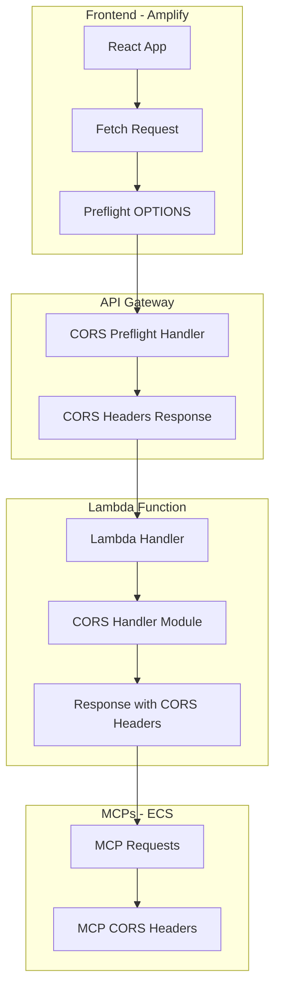

# 🔒 Configuración CORS Completa

## Cross-Origin Resource Sharing (CORS) en AWS Propuestas v3

Este documento explica la configuración completa de CORS implementada para resolver problemas de conectividad entre el frontend y backend.

## 🎯 **Problema Resuelto**

### **Error Original**
```javascript
// ❌ Error CORS típico
Access to fetch at 'https://api.example.com/arquitecto' from origin 'https://frontend.com' 
has been blocked by CORS policy: No 'Access-Control-Allow-Origin' header is present
```

### **Solución Implementada**
```javascript
// ✅ CORS configurado correctamente
Response Headers:
Access-Control-Allow-Origin: *
Access-Control-Allow-Methods: GET, POST, PUT, DELETE, OPTIONS
Access-Control-Allow-Headers: Content-Type, Authorization, X-Requested-With
```

## 🏗️ **Arquitectura CORS**



## 🔧 **Implementación en Lambda**

### **Módulo CORS Handler**

```python
# lambda/arquitecto/cors_handler.py

def get_cors_headers():
    """Get standard CORS headers for all responses"""
    return {
        'Access-Control-Allow-Origin': '*',
        'Access-Control-Allow-Methods': 'GET, POST, PUT, DELETE, OPTIONS',
        'Access-Control-Allow-Headers': 'Content-Type, Authorization, X-Requested-With, Accept, Origin',
        'Access-Control-Max-Age': '86400',  # 24 horas
        'Content-Type': 'application/json'
    }

def handle_preflight_request():
    """Handle OPTIONS preflight requests"""
    return {
        'statusCode': 200,
        'headers': get_cors_headers(),
        'body': ''
    }

def create_response(status_code, body, additional_headers=None):
    """Create a properly formatted response with CORS headers"""
    headers = get_cors_headers()
    
    if additional_headers:
        headers.update(additional_headers)
    
    return {
        'statusCode': status_code,
        'headers': headers,
        'body': body if isinstance(body, str) else json.dumps(body)
    }
```

### **Integración en Lambda Handler**

```python
# lambda/arquitecto/app.py

from cors_handler import handle_preflight_request, create_success_response, create_error_response

def lambda_handler(event, context):
    """Main Lambda handler with CORS support"""
    
    try:
        # Handle CORS preflight requests
        if event.get('httpMethod') == 'OPTIONS':
            return handle_preflight_request()
        
        # ... lógica principal ...
        
        # Respuesta exitosa con CORS
        return create_success_response({
            'response': response_content,
            'usage': bedrock_response.get('usage', {}),
            'mcpUsed': mcp_used
        })
        
    except Exception as e:
        # Respuesta de error con CORS
        return create_error_response(500, f'Internal server error: {str(e)}')
```

## 🌐 **Configuración API Gateway**

### **Método OPTIONS**

```yaml
# CloudFormation template
OptionsMethod:
  Type: AWS::ApiGateway::Method
  Properties:
    RestApiId: !Ref ApiGateway
    ResourceId: !Ref ArquitectoResource
    HttpMethod: OPTIONS
    AuthorizationType: NONE
    Integration:
      Type: MOCK
      IntegrationResponses:
        - StatusCode: 200
          ResponseParameters:
            method.response.header.Access-Control-Allow-Headers: "'Content-Type,X-Amz-Date,Authorization,X-Api-Key,X-Amz-Security-Token'"
            method.response.header.Access-Control-Allow-Methods: "'GET,POST,PUT,DELETE,OPTIONS'"
            method.response.header.Access-Control-Allow-Origin: "'*'"
          ResponseTemplates:
            application/json: ''
      RequestTemplates:
        application/json: '{"statusCode": 200}'
    MethodResponses:
      - StatusCode: 200
        ResponseParameters:
          method.response.header.Access-Control-Allow-Headers: false
          method.response.header.Access-Control-Allow-Methods: false
          method.response.header.Access-Control-Allow-Origin: false
```

### **Métodos POST/GET**

```yaml
# Configuración para métodos principales
PostMethod:
  Type: AWS::ApiGateway::Method
  Properties:
    RestApiId: !Ref ApiGateway
    ResourceId: !Ref ArquitectoResource
    HttpMethod: POST
    AuthorizationType: NONE
    Integration:
      Type: AWS_PROXY
      IntegrationHttpMethod: POST
      Uri: !Sub 'arn:aws:apigateway:${AWS::Region}:lambda:path/2015-03-31/functions/${ArquitectoFunction.Arn}/invocations'
      IntegrationResponses:
        - StatusCode: 200
          ResponseParameters:
            method.response.header.Access-Control-Allow-Origin: "'*'"
    MethodResponses:
      - StatusCode: 200
        ResponseParameters:
          method.response.header.Access-Control-Allow-Origin: false
```

## 🐳 **CORS en MCPs (ECS)**

### **Configuración en MCPs**

```python
# official-mcp-servers/*/mcp_http_wrapper.py

from fastapi import FastAPI
from fastapi.middleware.cors import CORSMiddleware

app = FastAPI(title="MCP Server")

# Configuración CORS para MCPs
app.add_middleware(
    CORSMiddleware,
    allow_origins=[
        "https://main.d2xsphsjdxlk24.amplifyapp.com",  # Producción
        "http://localhost:3000",                        # Desarrollo
        "*"                                            # Permitir todos (desarrollo)
    ],
    allow_credentials=True,
    allow_methods=["GET", "POST", "PUT", "DELETE", "OPTIONS"],
    allow_headers=["*"],
)

@app.options("/{path:path}")
async def options_handler(path: str):
    """Handle preflight requests for all paths"""
    return {"status": "ok"}
```

### **Headers en Respuestas MCP**

```python
# Respuestas de MCPs incluyen headers CORS
@app.get("/health")
async def health_check():
    return Response(
        content=json.dumps({"status": "ok", "service": "core"}),
        media_type="application/json",
        headers={
            "Access-Control-Allow-Origin": "*",
            "Access-Control-Allow-Methods": "GET, POST, OPTIONS",
            "Access-Control-Allow-Headers": "Content-Type"
        }
    )
```

## 🔍 **Testing CORS**

### **Test Manual con cURL**

```bash
# Test preflight request
curl -X OPTIONS \
  -H "Origin: https://main.d2xsphsjdxlk24.amplifyapp.com" \
  -H "Access-Control-Request-Method: POST" \
  -H "Access-Control-Request-Headers: Content-Type" \
  -v https://jvdvd1qcdj.execute-api.us-east-1.amazonaws.com/prod/arquitecto

# Verificar headers en respuesta
# Debe incluir:
# Access-Control-Allow-Origin: *
# Access-Control-Allow-Methods: GET, POST, PUT, DELETE, OPTIONS
# Access-Control-Allow-Headers: Content-Type, Authorization, X-Requested-With
```

### **Test desde Frontend**

```javascript
// Test de conectividad CORS desde React
const testCORS = async () => {
    try {
        const response = await fetch('/api/arquitecto', {
            method: 'POST',
            headers: {
                'Content-Type': 'application/json',
            },
            body: JSON.stringify({
                messages: [{ role: 'user', content: 'test' }]
            })
        });
        
        console.log('CORS working:', response.ok);
    } catch (error) {
        console.error('CORS error:', error);
    }
};
```

### **Test Automatizado**

```python
# lambda/arquitecto/test_cors.py

import requests
import json

def test_cors_preflight():
    """Test CORS preflight request"""
    
    url = "https://jvdvd1qcdj.execute-api.us-east-1.amazonaws.com/prod/arquitecto"
    
    headers = {
        'Origin': 'https://main.d2xsphsjdxlk24.amplifyapp.com',
        'Access-Control-Request-Method': 'POST',
        'Access-Control-Request-Headers': 'Content-Type'
    }
    
    response = requests.options(url, headers=headers)
    
    assert response.status_code == 200
    assert 'Access-Control-Allow-Origin' in response.headers
    assert 'Access-Control-Allow-Methods' in response.headers
    
    print("✅ CORS preflight test passed")

def test_cors_actual_request():
    """Test actual request with CORS"""
    
    url = "https://jvdvd1qcdj.execute-api.us-east-1.amazonaws.com/prod/arquitecto"
    
    payload = {
        'messages': [{'role': 'user', 'content': 'test'}],
        'modelId': 'anthropic.claude-3-5-sonnet-20241022-v2:0'
    }
    
    headers = {
        'Content-Type': 'application/json',
        'Origin': 'https://main.d2xsphsjdxlk24.amplifyapp.com'
    }
    
    response = requests.post(url, json=payload, headers=headers)
    
    assert 'Access-Control-Allow-Origin' in response.headers
    print("✅ CORS actual request test passed")

if __name__ == "__main__":
    test_cors_preflight()
    test_cors_actual_request()
```

## 🚨 **Troubleshooting CORS**

### **Errores Comunes**

#### **1. Missing Access-Control-Allow-Origin**
```
Error: No 'Access-Control-Allow-Origin' header is present
```
**Solución**: Verificar que `get_cors_headers()` se llame en todas las respuestas.

#### **2. Preflight Request Failed**
```
Error: Response to preflight request doesn't pass access control check
```
**Solución**: Implementar handler para método OPTIONS.

#### **3. Headers Not Allowed**
```
Error: Request header field X-Custom-Header is not allowed
```
**Solución**: Agregar header a `Access-Control-Allow-Headers`.

### **Debugging Steps**

```bash
# 1. Verificar headers en respuesta
curl -I https://api.example.com/arquitecto

# 2. Test preflight específico
curl -X OPTIONS \
  -H "Origin: https://frontend.com" \
  -H "Access-Control-Request-Method: POST" \
  https://api.example.com/arquitecto

# 3. Verificar logs de Lambda
aws logs filter-log-events \
  --log-group-name /aws/lambda/aws-propuestas-v3-arquitecto-prod \
  --filter-pattern "CORS"
```

## 📊 **Monitoreo CORS**

### **CloudWatch Metrics**

```python
# Métricas personalizadas para CORS
import boto3

cloudwatch = boto3.client('cloudwatch')

def log_cors_metrics(request_origin, success):
    """Log CORS metrics to CloudWatch"""
    
    cloudwatch.put_metric_data(
        Namespace='AWS/Propuestas/CORS',
        MetricData=[
            {
                'MetricName': 'CORSRequests',
                'Dimensions': [
                    {
                        'Name': 'Origin',
                        'Value': request_origin
                    },
                    {
                        'Name': 'Success',
                        'Value': str(success)
                    }
                ],
                'Value': 1,
                'Unit': 'Count'
            }
        ]
    )
```

### **Alertas CORS**

```yaml
# CloudWatch Alarm para errores CORS
CORSErrorAlarm:
  Type: AWS::CloudWatch::Alarm
  Properties:
    AlarmName: CORS-Errors-High
    AlarmDescription: High number of CORS errors
    MetricName: CORSRequests
    Namespace: AWS/Propuestas/CORS
    Statistic: Sum
    Period: 300
    EvaluationPeriods: 2
    Threshold: 10
    ComparisonOperator: GreaterThanThreshold
    Dimensions:
      - Name: Success
        Value: "false"
```

## ✅ **Verificación Final**

### **Checklist CORS**

- ✅ **Lambda Handler**: Maneja OPTIONS requests
- ✅ **Response Headers**: Incluye todos los headers CORS necesarios
- ✅ **API Gateway**: Configurado para CORS
- ✅ **MCPs**: Headers CORS en todas las respuestas
- ✅ **Frontend**: Puede hacer requests sin errores CORS
- ✅ **Testing**: Tests automatizados pasan
- ✅ **Monitoring**: Métricas y alertas configuradas

### **Dominios Permitidos**

```javascript
// Configuración actual de orígenes permitidos
const allowedOrigins = [
    'https://main.d2xsphsjdxlk24.amplifyapp.com',  // Producción Amplify
    'http://localhost:3000',                        // Desarrollo local
    'https://localhost:3000',                       // Desarrollo local HTTPS
    '*'                                            // Permitir todos (solo desarrollo)
];
```

---

**🔒 CORS configurado correctamente para máxima compatibilidad y seguridad.**
