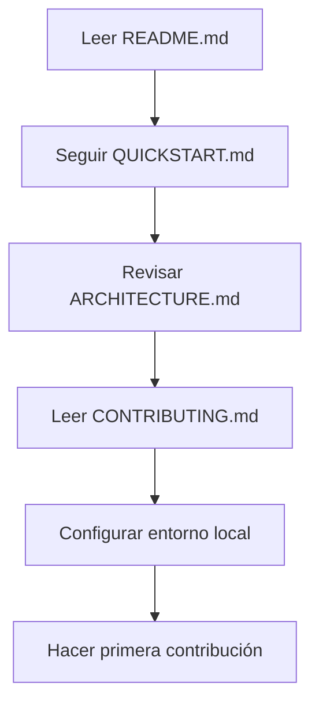
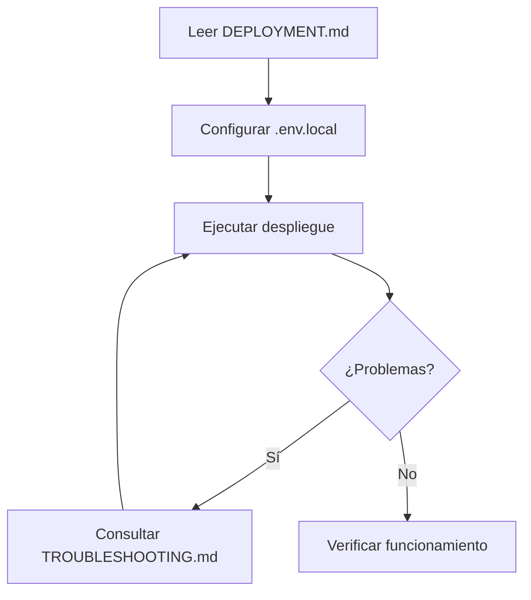
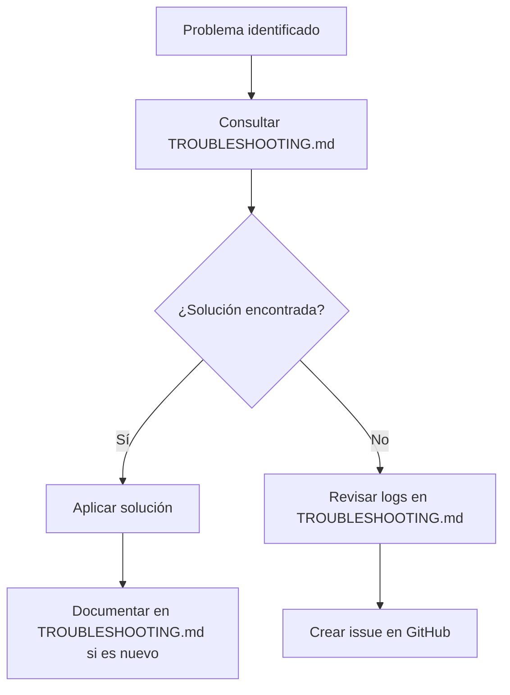

# Documentación - AWS Propuestas v3

Bienvenido al centro de documentación de AWS Propuestas v3. Aquí encontrarás toda la información necesaria para entender, instalar, configurar y contribuir al proyecto.

## 📚 Índice de Documentación

### 🚀 Primeros Pasos
- **[README.md](../README.md)** - Introducción general al proyecto y guía de inicio rápido
- **[QUICKSTART.md](../QUICKSTART.md)** - Guía de inicio rápido para comenzar en 5 minutos
- **[DEPLOYMENT.md](../DEPLOYMENT.md)** - Guía completa de despliegue paso a paso

### 🏗️ Arquitectura y Diseño
- **[ARCHITECTURE.md](../ARCHITECTURE.md)** - Documentación completa de la arquitectura del sistema
- **[PROJECT_SUMMARY.md](../PROJECT_SUMMARY.md)** - Resumen ejecutivo del proyecto

### 🔧 Desarrollo y Contribución
- **[CONTRIBUTING.md](../CONTRIBUTING.md)** - Guía completa para contribuir al proyecto
- **[API.md](../API.md)** - Documentación completa de la API REST

### 🐛 Soporte y Troubleshooting
- **[TROUBLESHOOTING.md](../TROUBLESHOOTING.md)** - Guía de solución de problemas comunes
- **[CHANGELOG.md](../CHANGELOG.md)** - Historial de cambios y versiones

### ⚙️ Configuración
- **[.env.local.example](../.env.local.example)** - Archivo de ejemplo de configuración

## 🎯 Guías por Audiencia

### Para Desarrolladores
1. **Configuración inicial**: [README.md](../README.md) → [QUICKSTART.md](../QUICKSTART.md)
2. **Entender la arquitectura**: [ARCHITECTURE.md](../ARCHITECTURE.md)
3. **Contribuir**: [CONTRIBUTING.md](../CONTRIBUTING.md)
4. **API Reference**: [API.md](../API.md)

### Para DevOps/SysAdmins
1. **Despliegue**: [DEPLOYMENT.md](../DEPLOYMENT.md)
2. **Configuración**: [.env.local.example](../.env.local.example)
3. **Troubleshooting**: [TROUBLESHOOTING.md](../TROUBLESHOOTING.md)
4. **Arquitectura**: [ARCHITECTURE.md](../ARCHITECTURE.md)

### Para Product Managers
1. **Resumen del proyecto**: [PROJECT_SUMMARY.md](../PROJECT_SUMMARY.md)
2. **Funcionalidades**: [README.md](../README.md)
3. **Historial de cambios**: [CHANGELOG.md](../CHANGELOG.md)

### Para Usuarios Finales
1. **Inicio rápido**: [QUICKSTART.md](../QUICKSTART.md)
2. **Guía general**: [README.md](../README.md)
3. **Solución de problemas**: [TROUBLESHOOTING.md](../TROUBLESHOOTING.md)

## 📖 Documentación por Categoría

### 🔍 Información General
| Documento | Descripción | Audiencia |
|-----------|-------------|-----------|
| [README.md](../README.md) | Introducción y overview del proyecto | Todos |
| [PROJECT_SUMMARY.md](../PROJECT_SUMMARY.md) | Resumen ejecutivo y contexto | PM, Stakeholders |
| [CHANGELOG.md](../CHANGELOG.md) | Historial de versiones y cambios | Todos |

### 🚀 Instalación y Configuración
| Documento | Descripción | Audiencia |
|-----------|-------------|-----------|
| [QUICKSTART.md](../QUICKSTART.md) | Guía de inicio rápido (5 min) | Usuarios, Desarrolladores |
| [DEPLOYMENT.md](../DEPLOYMENT.md) | Guía completa de despliegue | DevOps, SysAdmins |
| [.env.local.example](../.env.local.example) | Configuración de variables de entorno | Desarrolladores, DevOps |

### 🏗️ Arquitectura y Desarrollo
| Documento | Descripción | Audiencia |
|-----------|-------------|-----------|
| [ARCHITECTURE.md](../ARCHITECTURE.md) | Arquitectura completa del sistema | Desarrolladores, Arquitectos |
| [API.md](../API.md) | Documentación de endpoints y API | Desarrolladores |
| [CONTRIBUTING.md](../CONTRIBUTING.md) | Guía de contribución y desarrollo | Desarrolladores |

### 🛠️ Soporte y Mantenimiento
| Documento | Descripción | Audiencia |
|-----------|-------------|-----------|
| [TROUBLESHOOTING.md](../TROUBLESHOOTING.md) | Solución de problemas comunes | Todos |

## 🔄 Flujos de Trabajo Comunes

### Nuevo Desarrollador

### Despliegue a Producción

### Resolución de Problemas

## 📊 Métricas de Documentación

### Cobertura de Documentación
- ✅ **Instalación**: 100% cubierto
- ✅ **Configuración**: 100% cubierto
- ✅ **API**: 100% cubierto
- ✅ **Arquitectura**: 100% cubierto
- ✅ **Troubleshooting**: 100% cubierto
- ✅ **Contribución**: 100% cubierto

### Tipos de Documentación
- 📋 **Guías de usuario**: 3 documentos
- 🔧 **Documentación técnica**: 4 documentos
- 🐛 **Soporte**: 2 documentos
- 📈 **Gestión**: 2 documentos

## 🔄 Mantenimiento de Documentación

### Responsabilidades
- **Desarrolladores**: Actualizar documentación técnica con cambios de código
- **DevOps**: Mantener guías de despliegue y troubleshooting
- **Product Manager**: Actualizar resúmenes y changelog
- **Community Manager**: Revisar guías de contribución

### Proceso de Actualización
1. **Cambios de código** → Actualizar API.md y ARCHITECTURE.md
2. **Nuevas funcionalidades** → Actualizar README.md y CHANGELOG.md
3. **Problemas comunes** → Actualizar TROUBLESHOOTING.md
4. **Cambios de proceso** → Actualizar CONTRIBUTING.md y DEPLOYMENT.md

### Revisión Periódica
- **Mensual**: Revisar exactitud de guías de instalación
- **Trimestral**: Actualizar arquitectura y API docs
- **Por release**: Actualizar CHANGELOG.md y versiones

## 📞 Contacto y Soporte

### Para Documentación
- **Issues de documentación**: [GitHub Issues](https://github.com/coedaniel/aws-propuestas-v3/issues) con label `documentation`
- **Sugerencias de mejora**: [GitHub Discussions](https://github.com/coedaniel/aws-propuestas-v3/discussions)

### Para Soporte Técnico
- **Bugs**: Usar plantilla de bug report en GitHub Issues
- **Preguntas**: GitHub Discussions o consultar TROUBLESHOOTING.md
- **Contribuciones**: Seguir CONTRIBUTING.md

## 🎯 Próximos Pasos

### Mejoras Planificadas
- [ ] Documentación de video tutoriales
- [ ] Guías específicas por caso de uso
- [ ] Documentación de integración con CI/CD
- [ ] Guías de migración entre versiones
- [ ] Documentación de performance tuning

### Contribuciones Bienvenidas
- Traducción de documentación a otros idiomas
- Ejemplos adicionales en guías existentes
- Casos de uso específicos
- Mejoras en claridad y estructura

---

**¿No encuentras lo que buscas?** 
- Revisa el [índice completo arriba](#-índice-de-documentación)
- Busca en [GitHub Issues](https://github.com/coedaniel/aws-propuestas-v3/issues)
- Crea una nueva [discusión](https://github.com/coedaniel/aws-propuestas-v3/discussions)

**Última actualización**: Julio 2024 | **Versión de documentación**: 3.0.0
